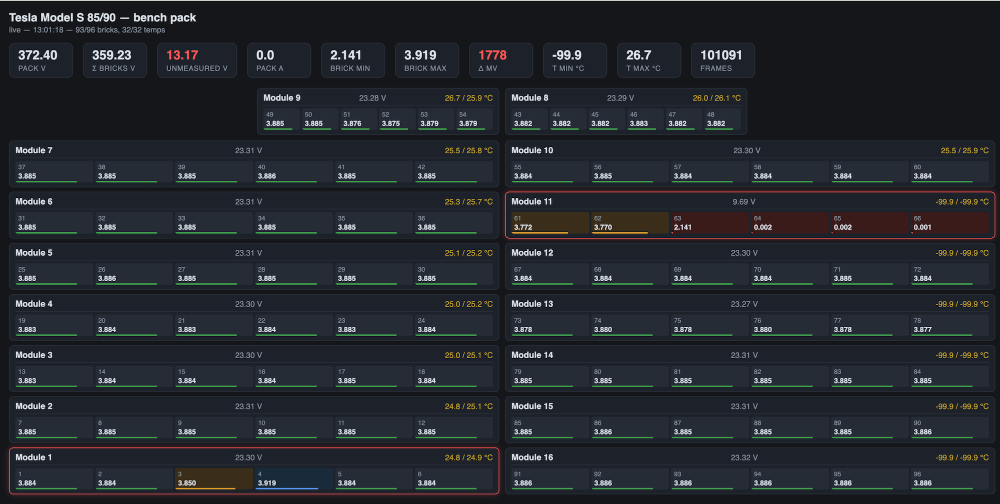
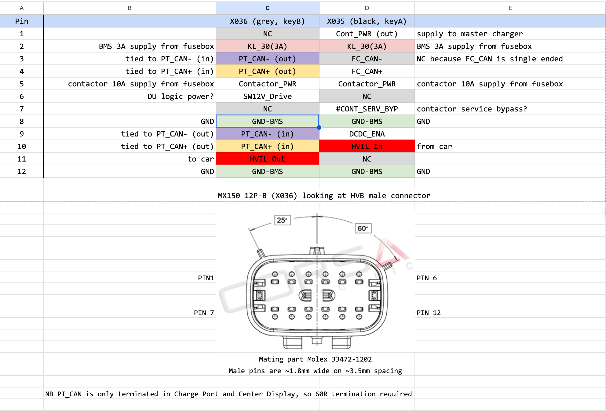
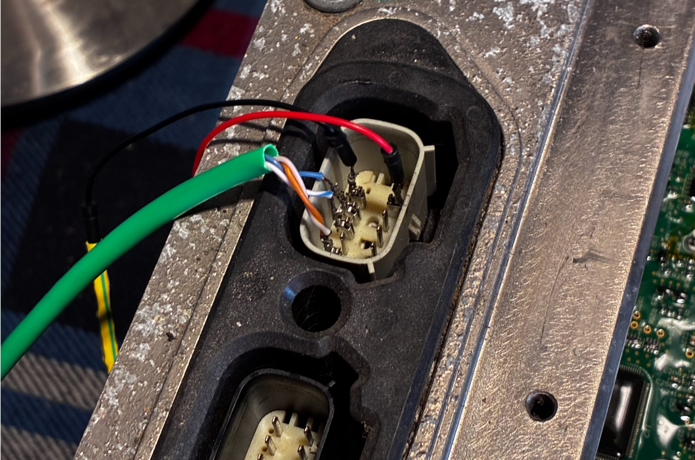
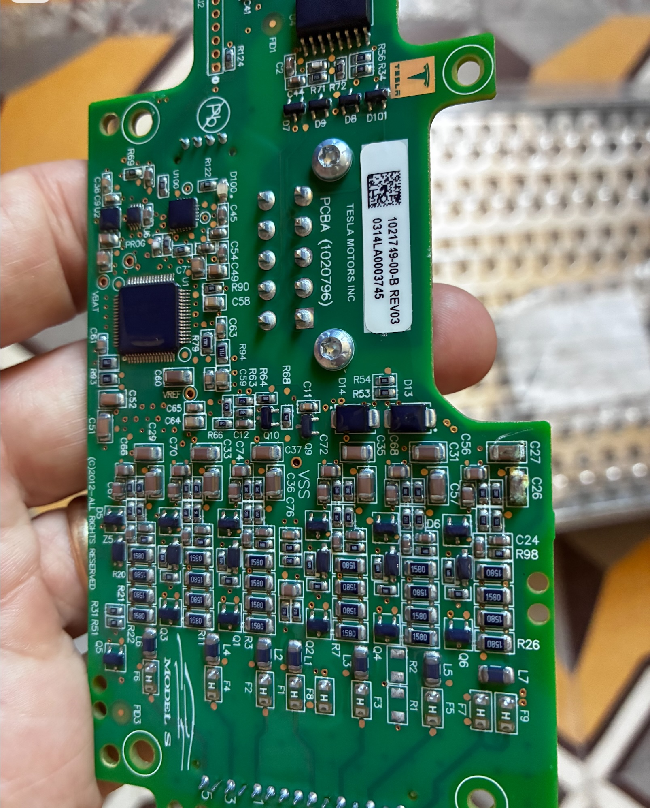
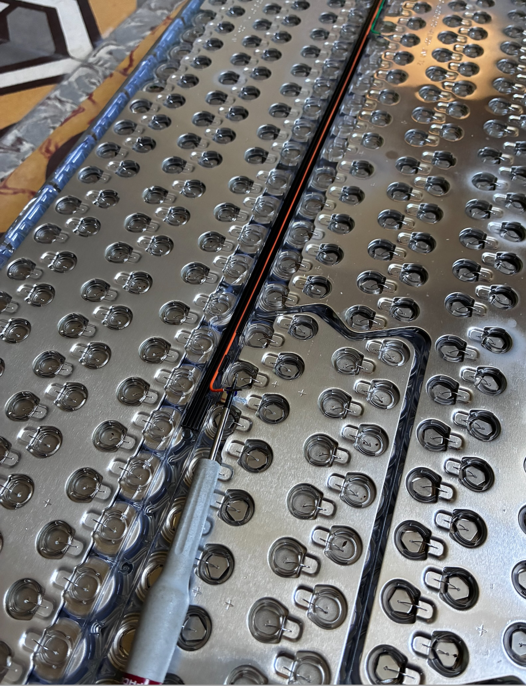
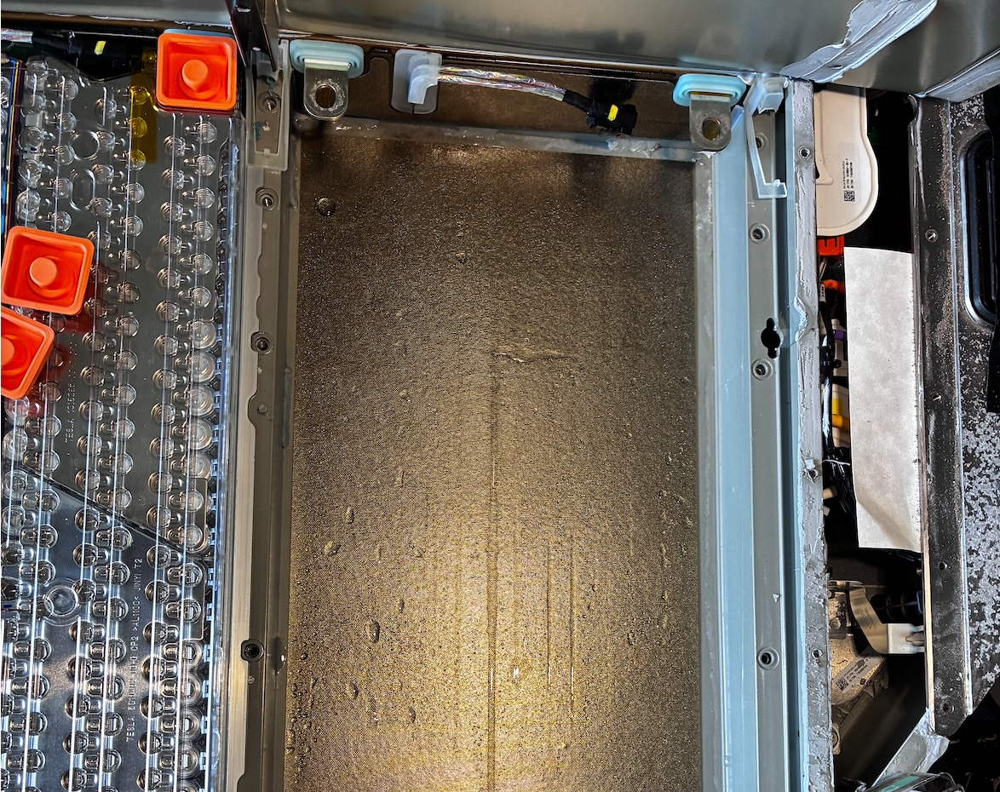

# PiCanScanMyTesla

Read cell voltages, temperatures and pack V/A from a bench Tesla Model S
85/90 battery pack over CAN. Small dashboard runs on a Pi in the workshop,
view it from any browser on the network.

Built for diagnosing a suspect module out of car. Known failure modes are
listed at the bottom. CAN decode, BMS behaviours, and the out-of-car
bring-up notes (HVIL, playing the car, contactor operation) are in
[NOTES.md](NOTES.md).



## What you get

- 96 brick voltages, 32 temperatures, pack V/A, updated every second
- Physical-layout dashboard, per-brick min/max tracking
- CSV log at `/var/log/teslamon.csv`, one row every 10 s
- Runs alongside SavvyCAN (via `canlogserver` on port 28700) if you want
  raw frames too

## Hardware

- A Raspberry Pi. Any Pi 3 or newer works. Zero 2 W is fine.
- A CANable-compatible USB-CAN adapter with slcan firmware. Anything
  speaking slcan should work. Tested with the RH02 clone.
- 12 V bench PSU for the pack BMS
- Wiring to the pack's LV connector X036 (grey, MX150 12P-B) on the
  penthouse

## Pack pinout, X036

Viewed at the connector on the pack. 



| Pin | Signal            | Notes                       |
|-----|-------------------|-----------------------------|
| 2   | KL_30 (+12 V)     | BMS 3 A supply              |
| 3   | PT_CAN- (out)     | tied to pin 9 internally    |
| 4   | PT_CAN+ (out)     | tied to pin 10 internally   |
| 5   | Contactor_PWR     | 10 A contactor coil supply  |
| 6   | SW12V_Drive       | switched 12 V, wake enable  |
| 8   | GND-BMS           |                             |
| 9   | PT_CAN- (in)      | CAN L                       |
| 10  | PT_CAN+ (in)      | CAN H                       |
| 11  | HVIL Out          | to car                      |
| 12  | GND-BMS           |                             |


The way I  as an example.

To read cell voltages you need at minimum: 12 V on pin 2, GND on pin 8 or
12, CAN pair on 9 (L) and 10 (H) at 500 kbit/s. The BMS wakes on any bus
traffic. The tool sends a heartbeat every 5 s.

Contactors do NOT need to close to read cell data. If you do want
contactors, jumper HVIL closed with 180 Ω between X036/11 (out) and
X035/10 (in) on the other connector, butead the safety notes first.

X035 (black, keyA) mirrors PT_CAN on its own pins for daisy-chaining. Do
not use X035 pins 3/4 for cell data, those are FC_CAN and carry no BMS
traffic.

## Install (on the Pi)

```
git clone https://github.com/jetpax/PiCanScanMyTesla.git
cd PiCanScanMyTesla
sudo ./install.sh
```

Then load `http://<pi-hostname>.local:8080` from any browser on the
network.

The installer sets up three systemd units:

- `slcand.service` brings up `can0` at 500 kbit/s off `/dev/ttyACM0`
- `canlogserver.service` exposes port 28700 for SavvyCAN
- `teslamon.service` runs the web dashboard on port 8080

If you have other USB serial devices plugged in, edit
`/etc/systemd/system/slcand.service` to use a stable `/dev/serial/by-id/`
path.

## Using it

Wire up the pack, energize 12 V, load the dashboard. Within a few seconds
the "Frames" counter climbs and the modules populate.

The single most useful metric on the page is **Unmeasured V** in the
header: pack V minus sum of all 96 bricks. A healthy pack sits near zero.
A stuck ~23 V is one whole module unaccounted for, ~46 V is two, and so
on. That is almost always a BMB or sense-wire fault, not dead cells.
Believe the delta before you believe individual sub-1 V readings.

Per-brick "NN mV" figure is the spread since the "Reset min/max" button
was last hit. Under 5 mV at rest is normal. A brick that keeps twitching
by tens of mV while you flex a sense harness is your fault.

Physical layout on screen matches the pack viewed from the top:
modules 8 and 9 in the top row (coolant Bottom / Top rails), 7-1 down
the left column, 10-16 down the right.

## Known failure modes

All of these are water ingress driven. If one module is bad, inspect
every module before deciding it is the only one.

**C26 / C27 electrolyte corrosion on the BMB.** Look for green or white
oxidation around C26 and C27 on the small BMB PCB stuck to the module
top. Symptom: bricks above the mid-tap collapse to near zero or a
nonsense sub-1 V, bricks below read about 100 mV low but stay plausible.

 

Clean with IPA and a stiff brush, check the caps' solder joints, replace if the joints look eaten.

C26, C27 are 2.2uF 50V X7R 1026 capacitors, get them from your friendly disti, eg Digikey (490-4796-1-ND), TME etc

**Loose orange sense wire on the bottom of the module.** The main-tap
wires clip into the BMB. Vibration and corrosion loosen them. Symptom:
one brick reads as an outlier (tens of mV off pack median) while the
other five on that module are fine



Extend the sense wire and pop rivet it to the aluminium plate using a crimped eyelet.

**Broken BMB daisy chain.** The 16 BMB slaves talk to the master BMS over
a UART daisy chain at 612500 baud. Pull a BMB or lose a link and every
BMB downstream goes dark too. If your dashboard shows temps but no brick
voltages, and pack V reports SNA (0x102 with bytes 2-5 all 0xFF), suspect
a broken link.

**Water at the pack floor.** 

Regardless of what the BMS says, inspect the physical pack floor for
water damage. Dry, dry again, then diagnose.

Consider replacing the umbrella vaves with  - ASY,VENTS,GANGED,HVBATT
1517973-00-A

## CAN decoding

500 kbit/s. The frames the tool uses:

- `0x102` pack V (bytes 0-1, u16 LE, x0.01 V), current (bytes 2-3, s16 LE,
  x0.1 A)
- `0x302` SOC UI (byte 0 plus low 2 bits of byte 1, divide by 10 for %).
  Reads zero on a resting bench pack, treat as unknown.
- `0x6F2` per-brick voltages and temperatures. Byte 0 is the mux.
  - `mux 0..23` four 14-bit brick voltages per frame, packed LE across
    bytes 1-7, x0.000305 V. Brick n = 4 * mux + k.
  - `mux 24..31` four 14-bit signed temperatures, same packing,
    x0.0122 °C. Two sensors per module.
  - Raw 0 or 0x3FFF means "no data".

Also decoded into the health panel:

- `0x212` HVIL bit (d0 bit 6), BMS state (d2 high nibble), contactor
  state (d2 low nibble), isolation (d3 x 20 kOhm, 0xFF = not measured)
- `0x202` pack voltage limits (bytes 0-1 and 2-3, u16 LE x 0.01 V),
  max charge current (bytes 4-5, 14-bit x 0.1 A)
- `0x332` BMS's own brick min/max ( ((d1 and 0x0F)<<8 | d0) x 2 mV max,
  bytes 4-5 x 2 mV min) and pack temp min/max (d3, d7: x 0.5 - 40 C).
  Useful as a cross-check of the 0x6F2 decode.
- `0x382` energy status, 10-bit LE fields x 0.1 kWh. Field 0 = nominal
  full energy (pack capacity, the SoH headline). Remaining-energy fields
  read saturated/invalid on a bench pack, treat values >= nominal full
  as SNA.
- `0x3D2` lifetime energy, u32 LE Wh: bytes 0-3 = total charged,
  bytes 4-7 = total discharged (ratio gives round-trip efficiency,
  expect ~92%)
- `0x562` battery odometer, u32 LE x 0.001 mi

`0x5D2` is multiplexed (byte 0 = index), layout unknown, not decoded.

Two BMS behaviors worth knowing when watching this bus:

- **Rotating invalidate cadence.** The BMS periodically retransmits one
  8-mux block of 0x6F2 as all-FF (8 consecutive frames, 0.1 s apart, a
  different block every ~10 s). This is normal, not a dropout. Never
  clear cached values on an all-FF frame; a genuinely unreachable BMB
  (broken daisy chain) stops producing data frames entirely.
- **Periodic balance/bleed pulses.** The BMS periodically switches a
  bleed load across selected bricks (on this pack: 3 s on, ~40 s
  period). While the bleed is on, the bleed current's IR drop in the
  sense-tap wiring shifts the readings: the bled brick reads low by the
  sum of both tap-wire drops, and each neighbour reads high by one
  drop. The deflections obey a checkable identity (the neighbours' rises
  sum to the bled brick's dip, e.g. -58 = +41 and +17). Typical healthy
  harness numbers are 40 mV on the shared tap and 15-20 mV on the other,
  so repeating +-40-60 mV excursion pairs in the log are NORMAL and do
  not indicate a fault. Which bricks get bled is recomputed by the BMS
  per power cycle, so the pulse locations move between boots. A
  genuinely bad tap looks different: an outsized pulse (hundreds of mV)
  or a resting offset that never reverts.

BMS wake: the pack broadcasts nothing on a silent bus. Any single frame
at 500 kbit/s wakes it. The tool sends `0x555` with one zero data byte
every 5 s.

UDS pair is `0x602` request / `0x612` response, static seed/key. Not
needed for cell data since it broadcasts. Useful for anyone poking
further.

## Data export

Download button on the dashboard, or grab the file directly:

```
scp <user>@<pi>:/var/log/teslamon.csv .
```

Header row is `ts_iso, pack_v, pack_a, soc, b1..b96, t1..t32`. Drops
straight into Excel or `pandas.read_csv`.

## Safety

Pack terminals are lethal. Do not close the contactors unless you
understand what you are doing and have appropriate PPE and current
limits. Reading cell data does NOT require contactor closure.

The BMB PCBs are referenced to module HV. Do not probe them with a
grounded oscilloscope.


## License

MIT. See `LICENSE`.
